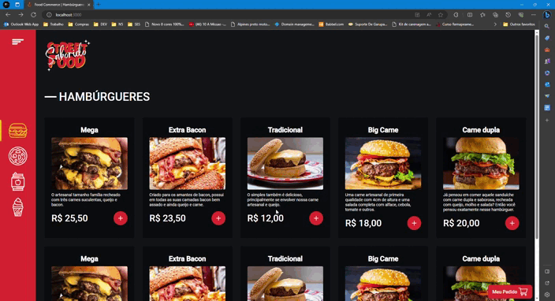

<h1 align="center"> Street Food Saborido </h1>

 Projeto E-Commerce desenvolvido para uma empresa de Fast food 

  <a href="#-tecnologias">Tecnologias e Conceitos</a>&nbsp;&nbsp;&nbsp;|&nbsp;&nbsp;&nbsp;
  <a href="#-funcionalidades">Funcionalidades</a>&nbsp;&nbsp;&nbsp;|&nbsp;&nbsp;&nbsp;
  <a href="#memo-licença">Licença</a>

  

 

  

## 🚀 Tecnologias e Conceitos

Esse projeto foi desenvolvido com as seguintes tecnologias e conceitos:

- Aplicativo PWA em React.js
- Typescript
- Styled Components
- React Router Dom
- React-toastify
- React Hook Form
- Axios
- Princípio de Redux
- Offline e Localstorage
- Gateway de pagamentos
- API Rest
- Integração Node.js
- Banco de dados com Prisma

## 💻 Funcionalidades:

- [x] Pedido online
- [x] Adicionar produtos no carrinho
- [x] toastify de notificação
- [x] Cálculo do total do pedido
- [x] Formulário com os dados do consumidor
- [x] Comunicação com o Gateway de pagamento
- [x] Layout responsivo (mobile e desktop).

## :memo: Licença

Esse projeto está sob a licença MIT.

---

:wave: Confira meu perfil profissional no [LinkedIn](https://www.linkedin.com/in/alexandreborgesschmidt/)
